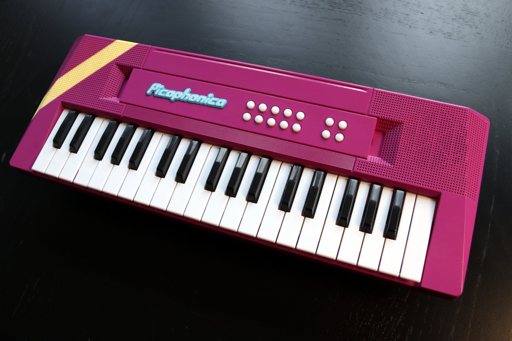
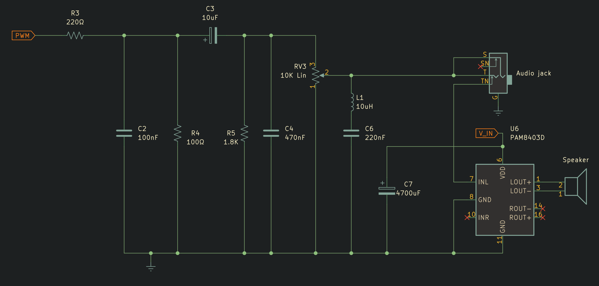

# Picophonica
## A Raspberry Pi Pico synth engine for a toy keyboard, with instrument presets and Midi out.

This repository contains my adaptation of the great little software synthesizer [pico_synth_ex](https://github.com/risgk/pico_synth_ex) by Ryo Ishigaki (ISGK Instruments) to serve as a new engine for a cheap toy musical keyboard. The new engine boasts two oscillators, featuring descending sawtooth and square waveforms, a customizable filter with resonance control, cutoff modulation, a Decay-Sustain amp envelope, and an LFO for added modulation possibilities.

Making-of video (with a soundtrack played on the Picophonica): [YouTube video](https://www.youtube.com/watch?v=ianoJ4pmsFE)

### Circuit wiring
Connect each row and column of your keyboard matrix to a GPIO pin, and define it in config.h.

The synth outputs audio via PWM. Connect PWMA_R_GPIO and/or PWMA_L_GPIO on the Pi Pico to the input of an amplifier. My keyboard came with a small amplifier and speaker, but if you need to build one, follow the design I used for [Dodepan](https://github.com/TuriSc/Dodepan), which also provides some noise filtering and DC offset removal. The choice of a switched 3.5mm jack means that when a cable is plugged into the audio output, the amp and speaker are bypassed.

I my build I managed to rewire a secondary keypad with fourteen keys, using it to recall the presets and change instrument parameters.
The existing, rather pointless 3.5mm microphone input found a new purpose as an audio output, while a USB-C port exposed through a simple adapter enables Midi-out functionality.

### More info
Picophonica is an original project.

More images on [my blog](https://turiscandurra.com/picophonica/).

[RP2040-pico_synth_ex/](https://github.com/TuriSc/RP2040-pico_synth_ex/) is a newer version of this synth engine with an improved audio quality due to its I²S sound capabilities.

### Version history
- 2023-12-17 - v1.1.0 - Added lookup tables with precomputed data; Enabled stereo output
- 2023-12-05 - v1.0.0 - First release
